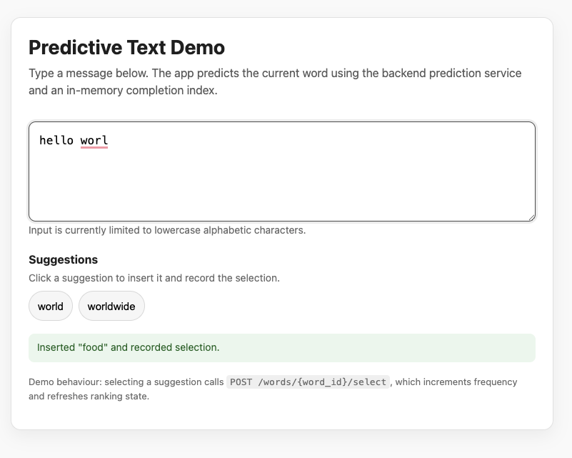
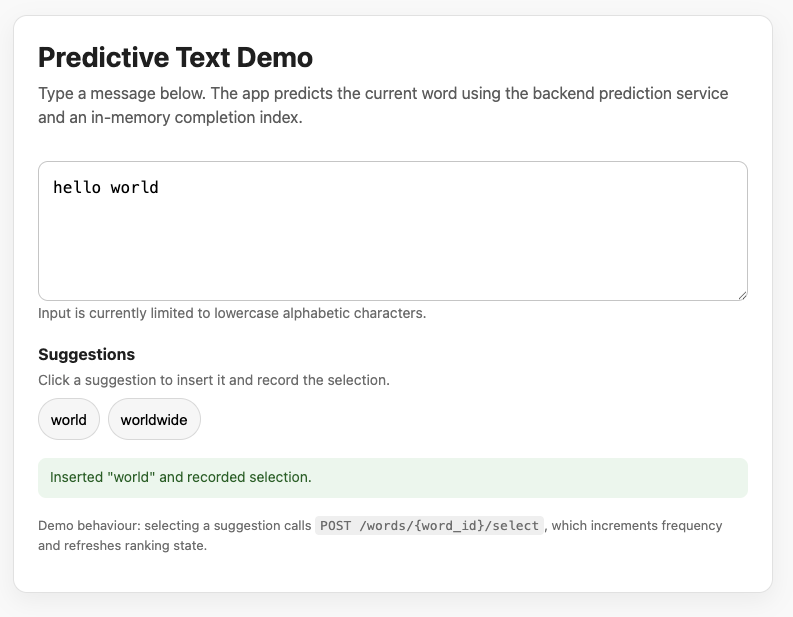

# Predictive Text Service

A backend service that provides fast word predictions based on user input, inspired by T9-style predictive text systems.

This project demonstrates how to combine **persistent storage, in-memory data structures, and clean architecture** to build a fast, stateful backend system.

This project is designed as a **learning exercise in software engineering, system design, and data structures**, with a focus on building a **stateful backend service** using clean architecture principles.

---

## 📚 Quick Links

- [Features](#-features)
- [Quick Start](#-quick-start)
- [Interactive Demo UI](#interactive-demo-ui)
- [API Demo Flow](#-api-demo-flow)
- [Why this project is interesting](#-why-this-project-is-interesting)
- [Architecture Overview](#-architecture-overview)
- [How it works](#-how-it-works)
- [Request Flow](#-request-flow)
- [Completion Index (Trie)](#-completion-index-trie)
- [Encoding Schemes](#-encoding-schemes)
- [Personalization](#-personalization)
- [API Endpoints](#-api-endpoints)
- [Concurrency Considerations](#-concurrency-considerations)
- [Learning goals](#-learning-goals)
- [Deployment Notes](#-deployment-notes)
- [Possible extensions](#-possible-extensions)
- [Summary](#-summary)

---

## 🚀 Features

- Predict words from text input (autocomplete-style)
- Predict words from encoded key sequences (T9-style or QWERTY)
- Pluggable encoding schemes (T9 and QWERTY)
- In-memory completion index for fast lookup
- SQLite-backed persistent word repository
- Personalization via user selection tracking
- Clean layered architecture (domain, application, infrastructure, API)

---

## ⚡ Quick Start

### Install

```
python -m pip install -e ".[dev]"
```

### Run

```
uvicorn predictive_texting.api.main:app --reload
```

### Swagger UI

```
http://127.0.0.1:8000/docs
```

---

## 🖥️ Interactive Demo UI

<a id="interactive-demo-ui"></a>

A lightweight browser-based demo is included to interact with the service in real time.

### Access

```
http://127.0.0.1:8000/
```

---

### Example

#### Live prediction



#### After selecting a word



---

### How to use

1. Start typing in the text area  
2. The system will:
   - detect the current word at the cursor
   - send it to `/predict/text`
   - display ranked suggestions  

3. Click a suggestion to:
   - insert the word into the text  
   - trigger a backend selection event (`POST /words/{word_id}/select`)  
   - update frequency and ranking  

---

### What this demonstrates

- Real-time prediction using an in-memory Trie index  
- Stateless API calls over a stateful backend  
- Personalization loop (frequency-based ranking updates)  
- Separation of frontend (client-side state) and backend (prediction engine)  

---

### Notes

- The UI is intentionally minimal and implemented with plain HTML + JavaScript  
- Input is currently limited to lowercase alphabetic characters  
- This UI is designed purely for demonstration purposes  

---

## 🧪 API Demo Flow

Try the following sequence:

1. Add a new word:

```
POST /words
{
  "word": "foobar"
}
```

2. Predict:

```
GET /predict/text?text=foo
```

3. Record selection using the returned `word_id`:

```
POST /words/{word_id}/select
```

4. Retrieve the word:

```
GET /words/{word_id}
```

The response should show the updated frequency.

5. Predict again:

```
GET /predict/text?text=foo
```

→ `foobar` should be present and improve in ranking over time.

---

## 🧠 Why this project is interesting

Most simple backend apps follow a pattern like:

```
Request → Database → Response
```

This project goes further by introducing a **stateful application layer**:

```
Startup:
    Load data → Build in-memory index → Initialise service

Request:
    Query in-memory index → Return results
```

### Key ideas explored:

- **Stateful backend design**  
- **Separation of concerns**  
- **In-memory vs persistent storage**  
- **Bootstrapping and lifecycle management**

---

## 🧭 Architecture Overview

```
Client
  ↓
FastAPI (API Layer)
  ↓
WordPredictionService (Application Layer)
  ↓
-----------------------------
| In-Memory Runtime State   |
| - WordStore              |
| - CompletionIndex (Trie) |
-----------------------------
  ↓
SQLite Repository (Persistence)
```

---

## ⚙️ How it works

At startup:

1. Database is initialised  
2. Repository is created  
3. Words are loaded into memory  
4. Trie index is built  
5. Service is hydrated  

---

## 🔁 Request Flow

```
User Input ("he")
    ↓
KeyEncoder
    ↓
Encoded keys
    ↓
Trie lookup
    ↓
Candidate IDs
    ↓
WordStore lookup
    ↓
Response
```

---

## 🌳 Completion Index (Trie)

A Trie maps encoded key prefixes to candidate words.

Why it matters:

- avoids scanning all words  
- fast prefix lookup  
- supports incremental updates  

---

## 🔤 Encoding Schemes

### T9 Encoding

```
h → 4
o → 6
→ "ho" → 46
```

### QWERTY Encoding (default)

```
a → 1
b → 2
...
h → 8
o → 15
```

---

## 🎯 Personalization

```
User selects a word
    ↓
Frequency increases
    ↓
Index refreshes
    ↓
Ranking improves
```

---

## 🌐 API Endpoints

Prediction:

- `GET /predict/text`
- `GET /predict/keys`

Word management:

- `POST /words`
- `GET /words/{word_id}`
- `POST /words/{word_id}/select`

---

## 🔒 Concurrency Considerations

- File locking prevents concurrent DB initialisation  
- In-memory state is shared and mutable  
- No locking currently → possible race conditions  

Future improvements:

- locks  
- worker model  
- distributed state  

---

## 📚 Learning goals

- Stateful backend design  
- Trie data structures  
- Clean architecture  
- Encoding abstraction  
- FastAPI lifecycle  

---

## 🚧 Deployment Notes

SQLite may not persist on platforms like Render.

Use PostgreSQL for production.

---

## 🔮 Possible extensions

- multi-language support  
- ML-based ranking  
- async DB  
- distributed system  

---

## ⚠️ Notes

- Learning project  
- Not production-ready  
- Focus on design clarity  

---

## 💡 Summary

- Stateful backend system  
- Clean architecture  
- Trie-based performance  
- Adaptive, personalized predictions  